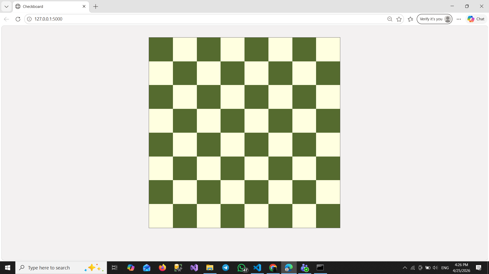
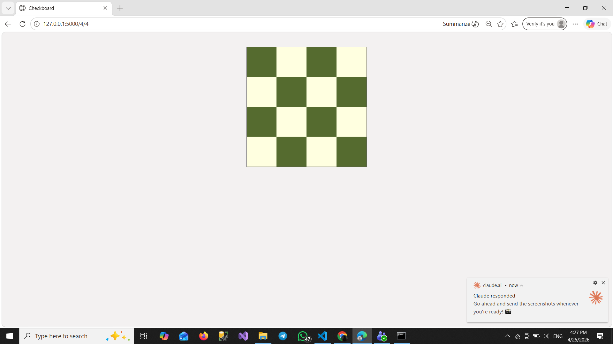
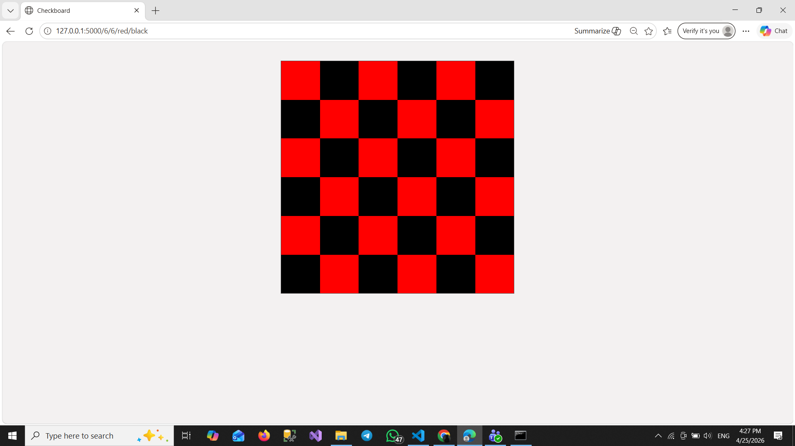

# Checkboard 🟩⬜

A dynamic checkerboard generator built with Flask. Customize the grid size and colors directly from the URL.

---

## Screenshots

**Default 8x8 board** — `127.0.0.1:5000`



**4x4 board** — `127.0.0.1:5000/4/4`



**6x6 Red & Black** — `127.0.0.1:5000/6/6/red/black`



---

## Project Structure

```
Checkboard/
│
├── checkboard.py
├── templates/
│   └── index.html
└── static/
    └── css/
        └── style.css
```

---

## Installation

1. **Clone or download** the project

2. **Install Flask**
   ```bash
   pip install flask
   ```

3. **Run the app**
   ```bash
   python checkboard.py
   ```

4. Open your browser and go to:
   ```
   http://127.0.0.1:5000
   ```

---

## Usage

You can customize the board via the URL:

| URL | Description |
|-----|-------------|
| `/` | Default 8x8 board with default colors |
| `/<x>` | Custom columns, 8 rows |
| `/<x>/<y>` | Custom columns and rows |
| `/<x>/<y>/<color1>/<color2>` | Custom size and colors |

### Examples

```
/8/8/red/blue
/10/10/green/yellow
```

## URL Parameters

| Parameter | Default | Description |
|-----------|---------|-------------|
| `x` | `8` | Number of columns |
| `y` | `8` | Number of rows |
| `color1` | `556B2F` (dark green) | Color of even squares |
| `color2` | `FFFFE0` (light yellow) | Color of odd squares |

---

## How It Works

- Flask receives the URL parameters and passes them to the HTML template
- Jinja2 loops through rows and columns using nested `` loops
- Each square gets its color based on `(row + col) % 2` — even = color1, odd = color2
- The container width is set dynamically as `x * 100px` to ensure correct grid wrapping