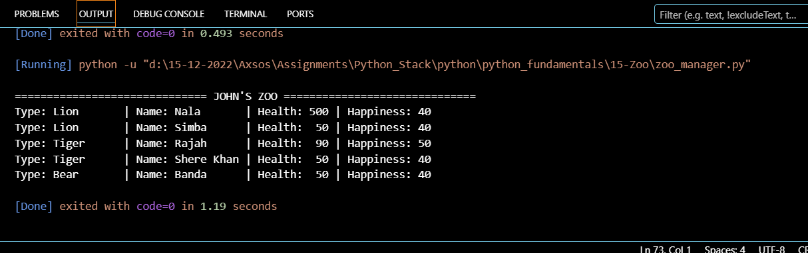

# Zoo Management System 
 An advanced, scalable zoo management simulator built with Python. This project demonstrates the power of Object-Oriented Programming (OOP) to manage complex relationships between different animal species efficiently.

# 🏗️ Core Architecture :
This project isn't just about animals; it's a showcase of clean code principles:

  **Inheritance:** All species (Lion, Tiger, Monkey, Bear) inherit from the base Animal class to avoid code repetition. 

  **Polymorphism:** The Zoo class interacts with all animals through a single interface (add_animal), regardless of their specific type.

  **Method Overriding:** Specialized behaviors (like unique feeding requirements) are implemented by overriding parent methods.

# 🛠️ Detailed Class Hierarchy :
 **1. Animal (The Parent)**
  Attributes: name, age, health_level, happiness_level.
  Methods: display_info() (universal reporting), feed() (basic stat boost).

 **2. Specialized Species (The Children)**
  Each child class introduces Unique Attributes:
    Lion: mane_color, is_king.
    Tiger: stripe_pattern.
    Monkey: tail_length, climbing_speed.
    Bear: fur_type, weight.

 **3. Zoo (The Manager)**
  Attribute: animals (A list to store all instances).
  Logic: Centralized management for adding animals and batch-printing reports.

# 💡 Technical Highlights:
 **Dynamic Type Detection:** Uses self.__class__.__name__ to identify species during runtime.

 **Super()Integration:** Properly handles parent initialization to ensure data integrity.

 **Output Formatting:** Uses f-string padding (e.g., {name:10}) for clean, tabular console output.

# 🚀 Getting Started:
Prerequisites => Python 3.x installed.
How to Run => Copy the code into a file named zoo_manager.py then Run the script: python zoo_manager.py

# 📊 Sample Output:

# 📝 License :
This project is for educational purposes. Feel free to use and expand it!